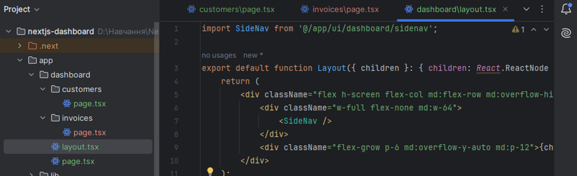
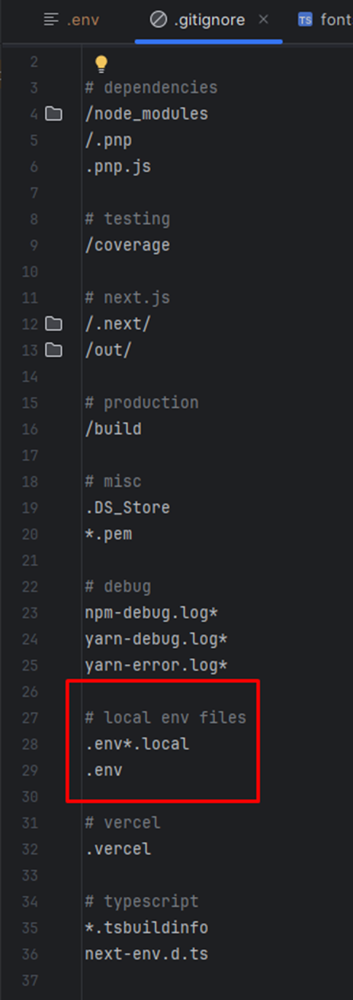
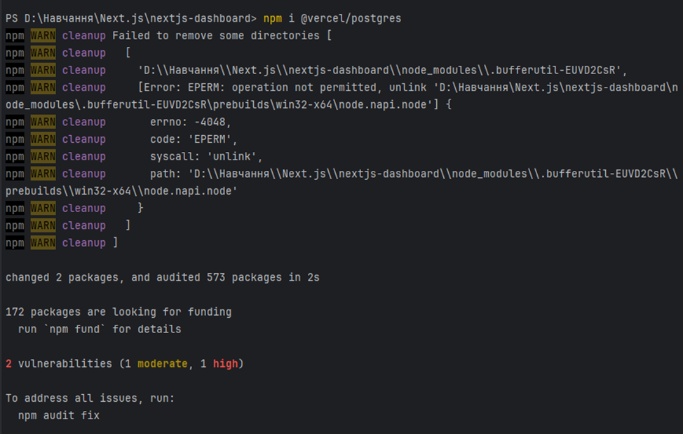
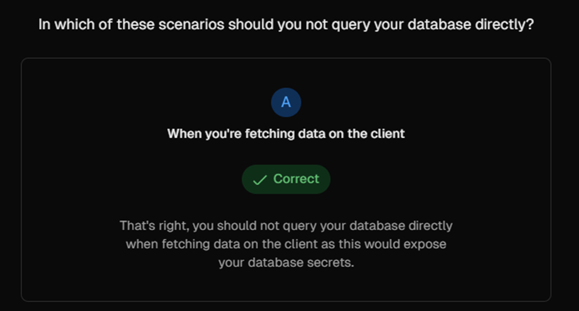
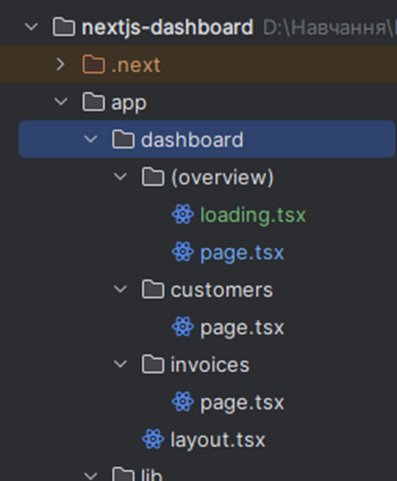
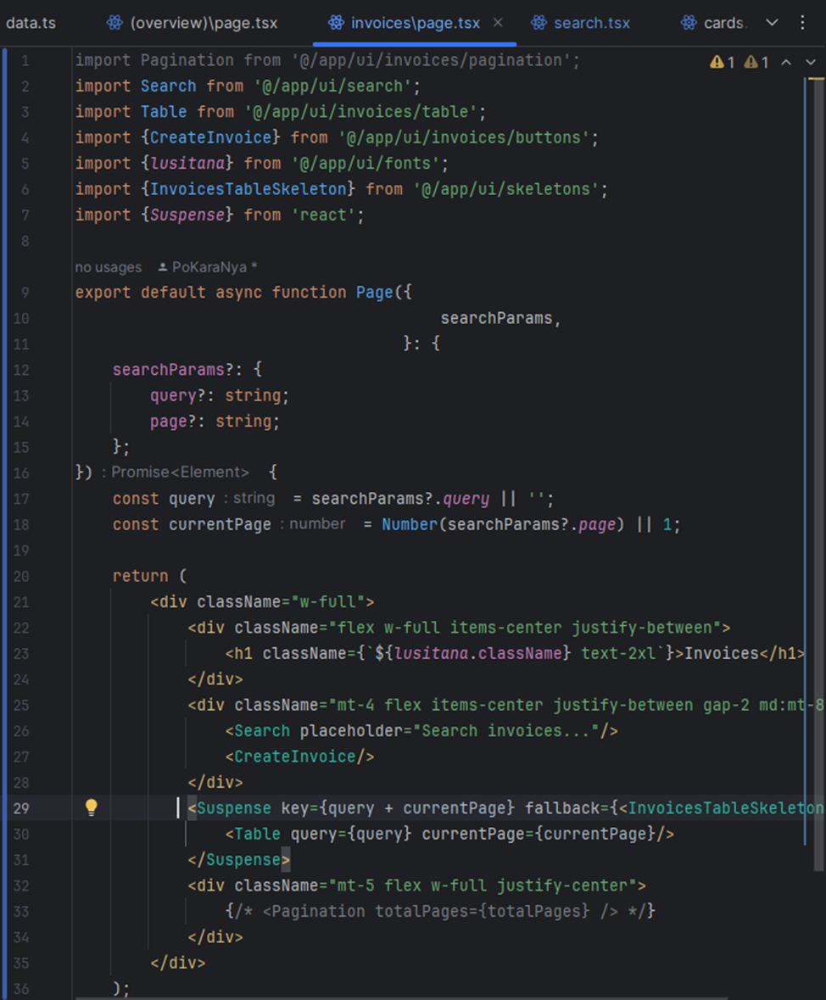
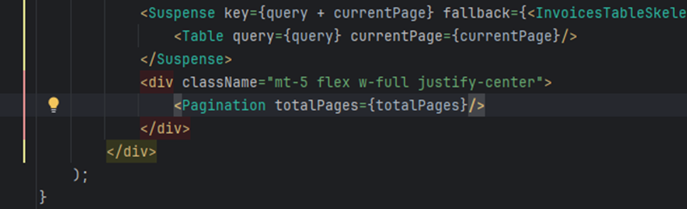
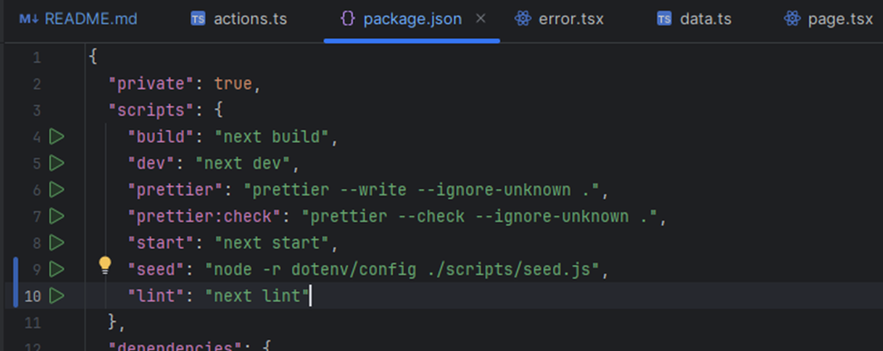
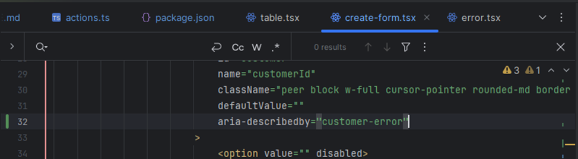

## Next.js App Router Course - Starter

This is the starter template for the Next.js App Router Course. It contains the starting code for the dashboard application.

For more information, see the [course curriculum](https://nextjs.org/learn) on the Next.js Website.

## Chapter 1. Getting Started

## Chapter 2. CSS Styling

## Chapter 3. Optimizing Fonts and Images

## Chapter 4. Creating Layouts and Pages

## Chapter 5. Navigating Between Pages

## Chapter 6. Setting Up Your Database

## Chapter 7. Fetching Data

## Chapter 8. Static and Dynamic Rendering

## Chapter 9. Streaming

## Chapter 10. Partial Prerendering (Optional)

## Chapter 11. Adding Search and Pagination

## Chapter 12. Mutating Data

## Chapter 13. Handling Errors

## Chapter 14. Improving Accessibility

## Chapter 15. Adding Authentication

